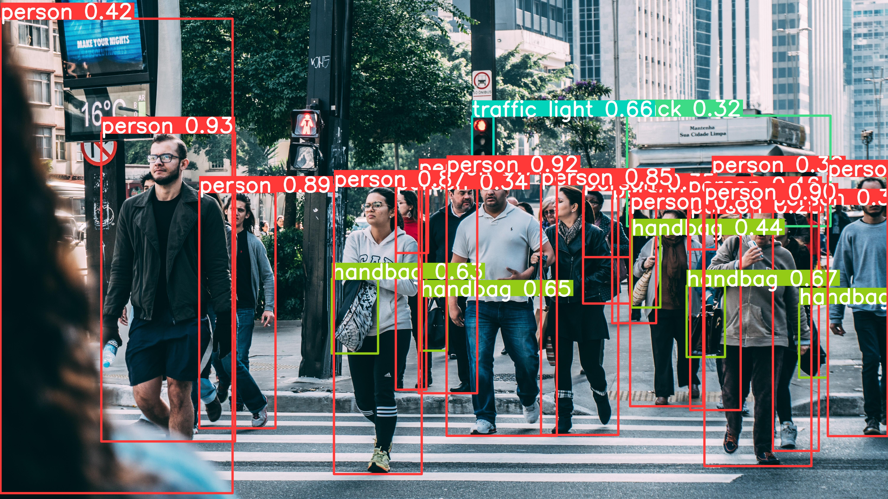

# Image Inference API with FastAPI and YOLO

This project provides a simple API for image inference using FastAPI and the YOLO (You Only Look Once) model for object detection.

## Installation

To get started, you'll need to install the required packages. You can do this using pip:

```bash
pip install fastapi[all] ultralytics PILLOW
```

## Usage

Once you have the necessary packages installed, you can run the FastAPI application using Uvicorn:

```bash
uvicorn main:app --reload
```

This will start the development server on `http://127.0.0.1:8000`.

## API Endpoints

### POST /inference-image

Infer objects from the uploaded image and get the inferenced image.

- **Input:**
  - **file**: The image file you want to infer.


  
- **Output:** 
  - The inferenced image file.



## Example

Here is an example of how you might call the API using `curl`:

```bash
curl -X 'POST' \
  'http://127.0.0.1:8000/inference-image' \
  -H 'accept: application/json' \
  -H 'Content-Type: multipart/form-data' \
  -F 'file=@your_image.png;type=image/png'
```

Replace `your_image.png` with the path to the image you want to infer.

## Implementation Details

### main.py

This file initializes the FastAPI app and defines the API endpoint for image inference. It saves the uploaded image, performs inference using the model defined in `predictor.py`, and returns the inferenced image.

### predictor.py

This file defines the `ImageInferencer` class which uses the YOLO model from the Ultralytics library to perform inference on the input image. The results are plotted on the image and saved to a new file.

## Contributing

If you'd like to contribute, please fork the repository and use a feature branch. Pull requests are warmly welcome.

## License

[MIT](LICENSE)
